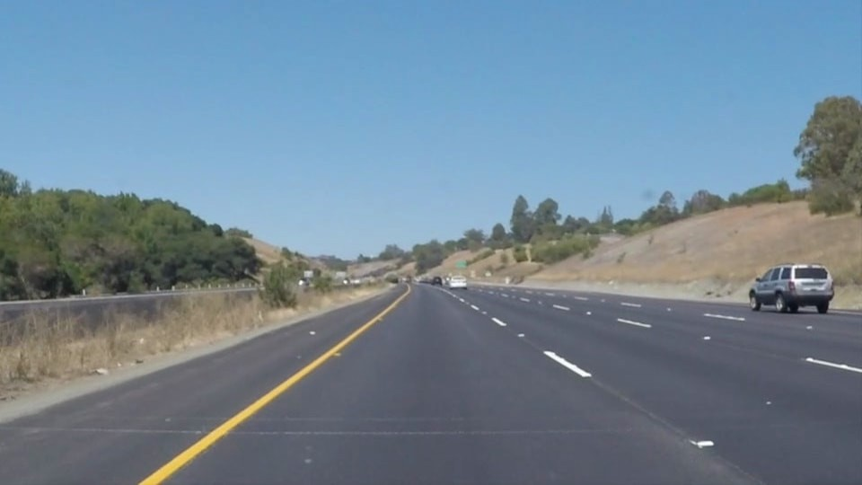
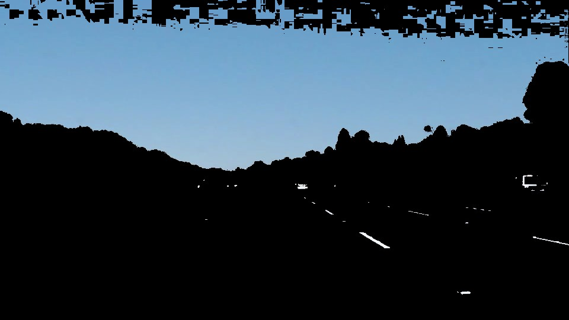
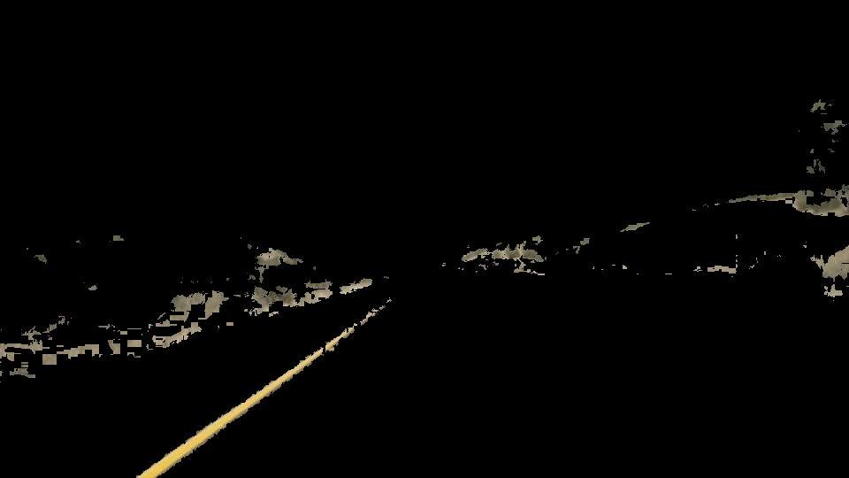
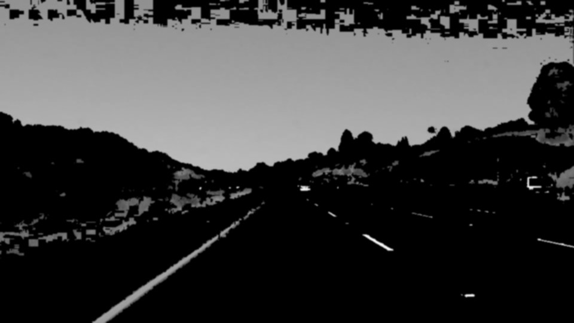
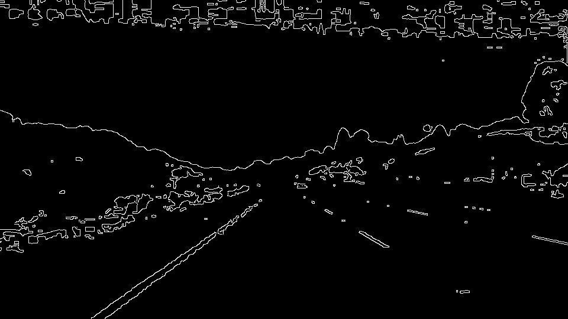
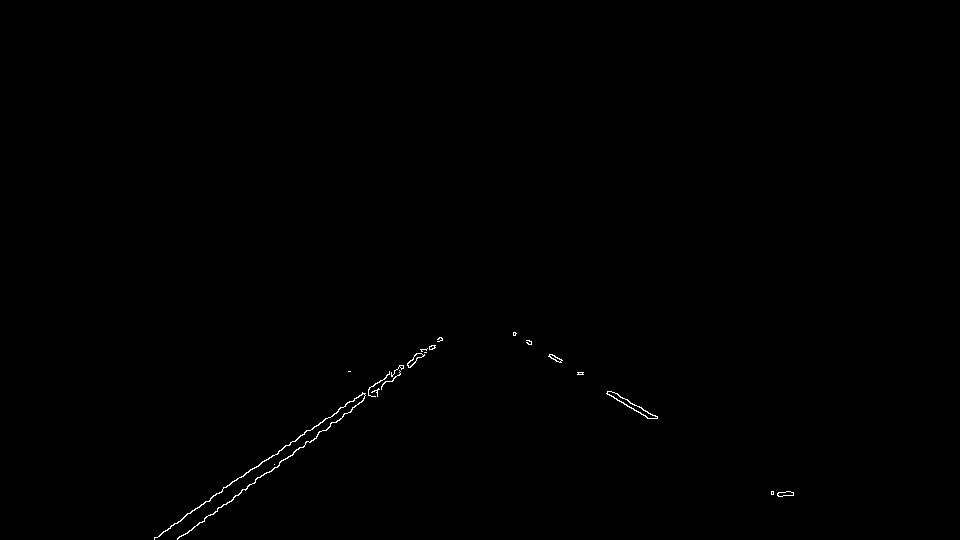
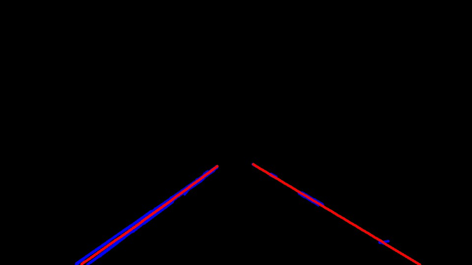
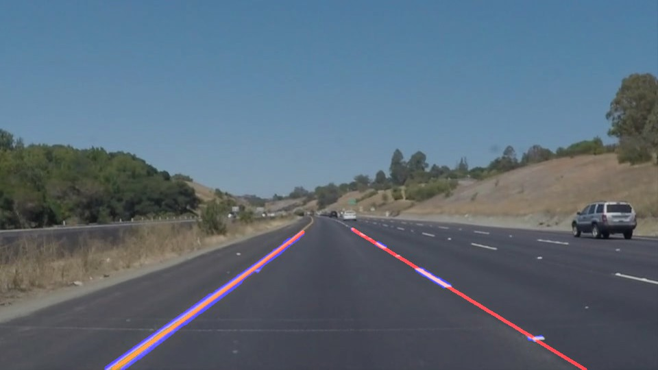

# **Finding Lane Lines on the Road** 

## Writeup Template

### You can use this file as a template for your writeup if you want to submit it as a markdown file. But feel free to use some other method and submit a pdf if you prefer.

---

**Finding Lane Lines on the Road**

The goals / steps of this project are the following:
* Make a pipeline that finds lane lines on the road
* Reflect on your work in a written report

[//]: # (Image References)

[image1]: ./examples/grayscale.jpg "Grayscale"

---

### Reflection

### 1. Describe your pipeline. As part of the description, explain how you modified the draw_lines() function.

Initially, I used grayscale on the original image but when I tried that pipeline on the challenge video it worked quite bad.
Finally, my pipeline consisted of the following steps:

* I filter the white color using RGB, filtering from [100,100,200] to [255,255,255] (generating a mask with `inRange` and the applying it with `cv2.bitwise_and()`)

* I filter the yellow color using HSL, from [20, 100, 100] to [30, 255, 255]

* I combine both the yellow and white filtered images with `weighted_img` after converting them to gray scale with `grayscale`

* I applied a blur of **3**. I initially aplied **5** but some far segments disappeared*

* I applied a `Canny` transform to get gradient

* I used the `HoughLinesP` to get the segments

* With the segments I called `draw_lines`, described below to generate generate the left and right lines

* Finally, I combined the lines image with the original image.

In order to draw a single line on the left and right lanes, I modified the draw_lines() function by:

* First I separated the left and right segments.
* For each segment, I created a point (x,y) starting at position x1 of the segment and ending at x2 with increments of 1 on x, and calculating y with the slope. 
* I added this point to different arrays for the left and right lines 
* I used a linear regression to calculate the final lines. Initially I tried to make the regression on a line `y = a*x + b`. Next I got better results using the regression to adjust the parameters `a,b,c` of the quadratic equation `x=a*y**2 + b*x + c``
* I draw the lines between max and min values for `y` in the previous regressions. I extrapolated the lines down to the bottom of the image using the slope at the last known point of y.

Original:

White filter:

Yellow filter:

Yellow & white combined:

Gaussian blur:

Canny edges:

Area of interest:

Hough lines (blue) and regression (red):

Final combined image:

### 2. Identify potential shortcomings with your current pipeline

Ppotential shortcomings would be what would happen when:

* A white or yellow car is in front of the camera, cars with stripes, etc. 

* When a car is changing lanes

* When the camera is not centered in the lane

* When the lane is being painted and the old lines are a little bit visible

* When the lines are not painted like in dirt roads

* It's not been tested in night conditions

* If the curves are steep

* Hills and similar changes of the surface of the road

* Bugs and dirt are on the camera

### 3. Suggest possible improvements to your pipeline

A possible improvement would be to identify the horizon line to better calculate the are of interest

Another potential improvement could be to look for a different way of doing the line identification, probably using Convolutional Neural Network. Having a lot of tagged data would make it possible to deal with many different conditions

Modeling the distance to the points on 3D so the model can be more accurate

Adding memory between frames to make the line identification more robust, for instance, dealing with a car that is changing lanes and hiding part of the lines
